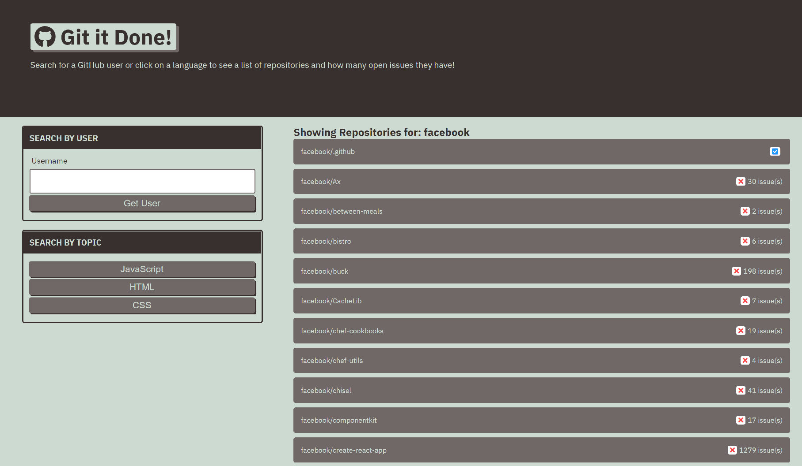

# git-it-done
A utility to display repositories with information on the number of open issues in that repository.

## Technologies
JavaScript, GitHub API, HTML, CSS

## Deployment
This is deployed at https://webgeekbear.github.io/git-it-done/

## Screenshot
